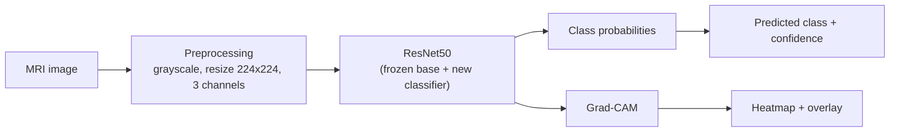
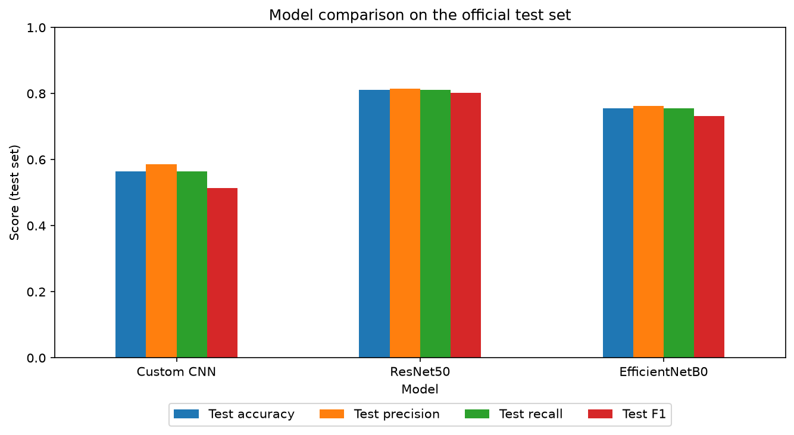
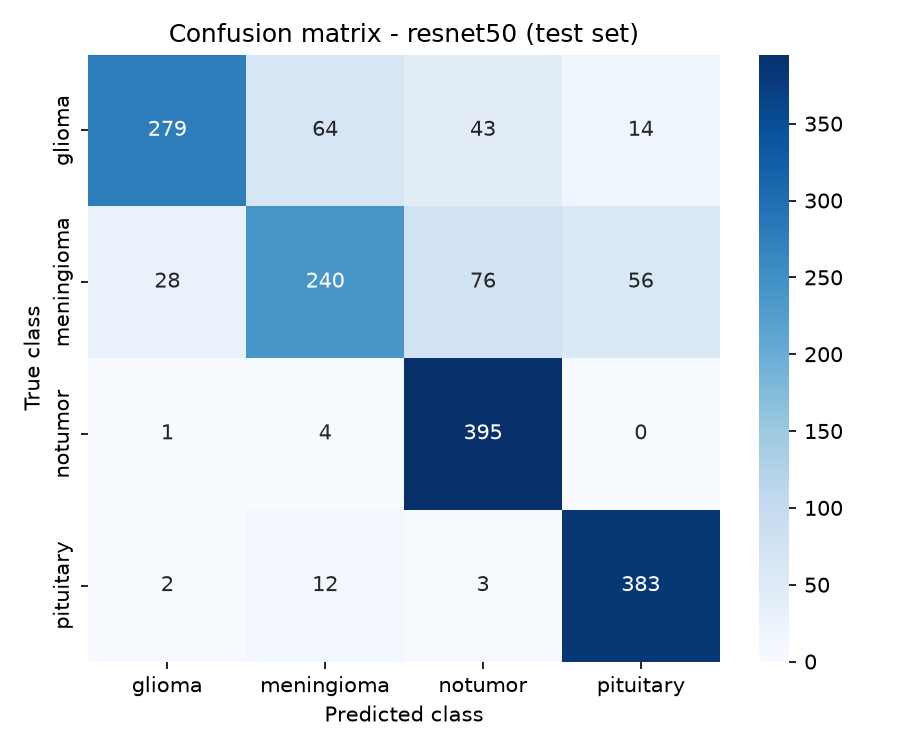
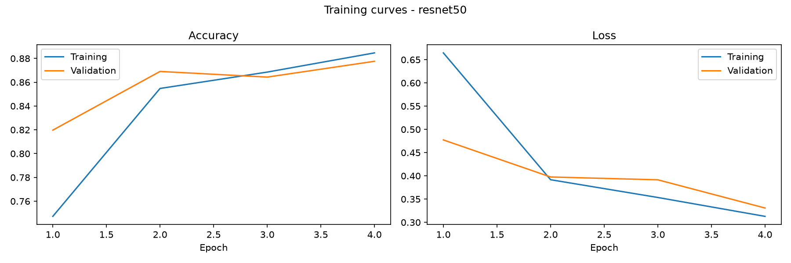
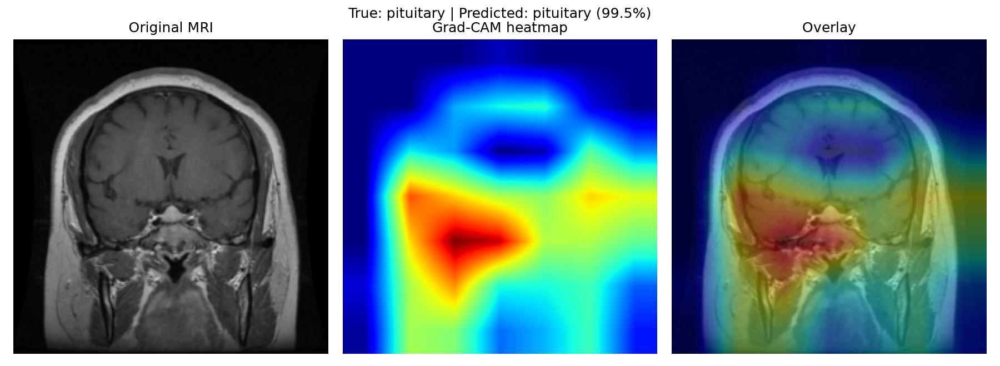
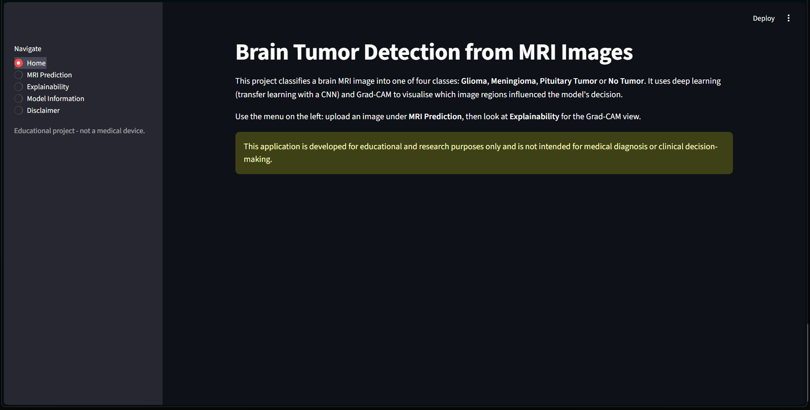
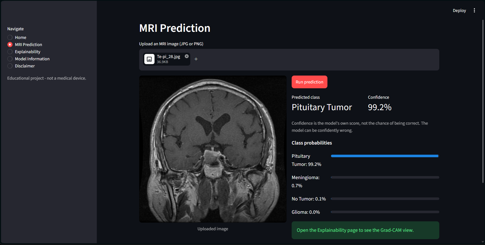
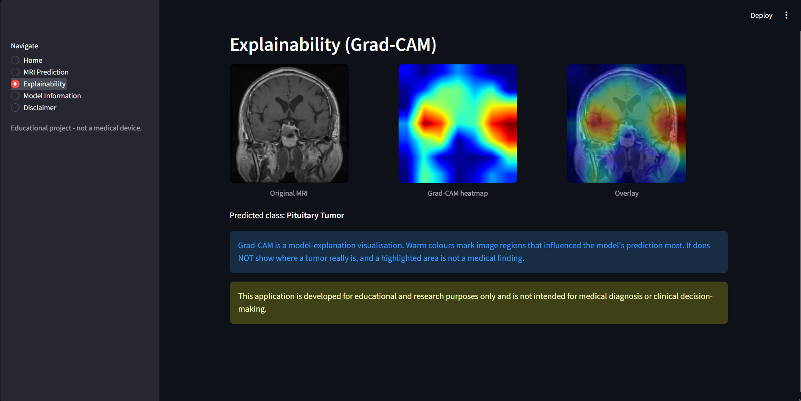

# Brain Tumor Detection from MRI

Classifying brain MRI images into **glioma, meningioma, pituitary tumor or no tumor** with deep learning, and explaining the predictions with Grad-CAM. Built as a 5th-semester *Python with Data Science* project.

> **Disclaimer:** This application is developed for educational and research purposes only and is not intended for medical diagnosis or clinical decision-making.

---

## Overview

The project compares three image-classification models on a public brain MRI dataset, selects the best one using validation data, explains its predictions with Grad-CAM, and serves it through a Streamlit web app. A large part of the work went into checking the dataset itself: removing duplicate and leaking images, and measuring how the model behaves on different kinds of scans. Those checks changed how the results should be read, and they are reported honestly below.

## Problem Statement

Given a single brain MRI image, predict which of four classes it belongs to, report how confident the model is, and show which image regions influenced the decision.

## Objectives

- Build an image-classification pipeline in Python (preprocessing, augmentation, training, evaluation).
- Compare a custom CNN with two pretrained models (ResNet50, EfficientNetB0) fairly.
- Detect and handle data leakage between training and test data.
- Explain predictions with Grad-CAM.
- Provide a simple Streamlit interface, with no database and no paid services.

## Dataset

Kaggle **"Brain Tumor MRI Dataset"** by Masoud Nickparvar (see the dataset page for its terms of use). The copy used here has an official `Training` and `Testing` split:

| Split | Images per class | Total |
|---|---:|---:|
| Training | 1,400 | 5,600 |
| Testing | 400 | 1,600 |

The dataset is **not** included in this repository. Download it from Kaggle and place the `Training/` and `Testing/` folders in `data/raw/`.

## Classes

`glioma`, `meningioma`, `notumor` (no tumor), `pituitary`

## Methodology



1. **Exploratory data analysis:** class counts, sample images, image sizes and colour modes.
2. **Data-quality checks:** exact and near-duplicate detection, leakage check between Training and Testing.
3. **Splitting:** the official Testing folder is kept untouched as the test set. The cleaned Training images are split 80/20 into train and validation, keeping near-duplicate images on the same side.
4. **Training** of three models with early stopping, checkpointing of the best epoch and learning-rate reduction.
5. **Evaluation** on validation and test data; the best model is chosen by **validation** macro-F1, not by test results.
6. **Explainability** with Grad-CAM and a **Streamlit** app.

## Data Preprocessing

Every image goes through the same steps (`src/data/preprocessing.py`):

- decode as grayscale (this removes the RGB-versus-grayscale difference found between classes),
- resize to 224 x 224,
- repeat the gray channel 3 times (pretrained models expect 3 channels),
- keep pixel values in 0-255; each model applies its own normalisation inside the model.

The same function is used for training and for the app, so predictions use identical preprocessing.

### Data cleaning and leakage check

| Check | Result |
|---|---|
| Unreadable files | 0 of 7,200 |
| Exact duplicate files inside Training | 171 |
| Exact duplicate files inside Testing | 16 (kept, official test set unchanged) |
| Exact copies shared between Training and Testing | 0 |
| Training images with a near-identical twin in Testing | 167 (removed from Training) |

Near-duplicates were found with a perceptual "difference hash" and confirmed visually. This method catches re-saved or re-contrasted copies; it can miss flipped, rotated or cropped copies, so some leakage may remain undetected.

After cleaning: **4,214 train + 1,054 validation** images (from 5,600) and **1,600 test** images.

| Class | Train | Validation | Test |
|---|---:|---:|---:|
| glioma | 1,116 | 280 | 400 |
| meningioma | 1,029 | 258 | 400 |
| notumor | 979 | 244 | 400 |
| pituitary | 1,090 | 272 | 400 |

## Data Augmentation

Applied to training images only (`src/data/augmentation.py`): horizontal flip, rotation up to about 14 degrees, zoom up to 10%, shift up to 5%, and small brightness/contrast changes. Empty corners are filled with black, like the scan background. Vertical flips and large rotations are not used because they would create scans that never occur in practice.

## Models

| Model | Parameters (total / trainable) | Notes |
|---|---:|---|
| Custom CNN | 110,276 / 110,276 | 3 conv blocks, global average pooling, dense + dropout; trained from scratch |
| ResNet50 | 23,595,908 / 8,196 | ImageNet weights, base frozen, new classifier head |
| EfficientNetB0 | 4,054,695 / 5,124 | ImageNet weights, base frozen, new classifier head |

Training settings: Adam (learning rate 1e-3), batch size 32, up to 20 epochs with early stopping on validation loss (patience 5). The pretrained models were trained for 4 and 6 epochs because of CPU time; no fine-tuning of the base networks was done.

## Model Comparison

Results on the official test set (1,600 images); macro-averaged over the four classes:

| Model | Val. accuracy | Test accuracy | Test precision | Test recall | Test F1 | Test ROC-AUC | Training time | Epochs |
|---|---:|---:|---:|---:|---:|---:|---:|---:|
| Custom CNN | 0.574 | 0.565 | 0.585 | 0.565 | 0.513 | 0.808 | 36.5 min | 7 |
| **ResNet50** | **0.878** | **0.811** | **0.815** | **0.811** | **0.803** | **0.953** | 44.3 min | 4 |
| EfficientNetB0 | 0.811 | 0.755 | 0.762 | 0.755 | 0.731 | 0.944 | 26.5 min | 6 |

All models were trained on CPU (Windows laptop). **ResNet50 was selected** because it had the highest validation macro-F1 (0.877); the test results agree with that ranking. The three models were trained for different numbers of epochs, so the comparison is indicative, not exact.



## Evaluation Metrics

Accuracy, precision, recall, F1-score (macro-averaged), the confusion matrix, and one-vs-rest ROC-AUC. Per-class results for the selected model (ResNet50, test set):

| Class | Precision | Recall | F1 |
|---|---:|---:|---:|
| glioma | 0.900 | 0.698 | 0.786 |
| meningioma | 0.750 | 0.600 | 0.667 |
| notumor | 0.764 | 0.988 | 0.862 |
| pituitary | 0.845 | 0.958 | 0.898 |




Meningioma is the hardest class for all three models.

## Dataset Shortcut and Distribution Shift (important finding)

Image size differs strongly between classes: most `notumor` images are **not** 512 x 512, while most tumor images are. In addition, the official split is not evenly mixed:

| Class | Non-512 images in train | in validation | in test |
|---|---:|---:|---:|
| glioma | 0 of 1,116 | 0 of 280 | **76** of 400 |
| meningioma | 21 of 1,029 | 9 of 258 | **117** of 400 |
| notumor | 968 of 979 | 242 of 244 | 397 of 400 |
| pituitary | 39 of 1,090 | 12 of 272 | 8 of 400 |

So in training, about 94% of the non-512 images are `notumor`, and non-512 glioma scans appear only in the test set. A model can therefore learn "differently sized image means no tumor". ResNet50 accuracy on the test set, split by image size:

| Class | 512 x 512 images | Other sizes |
|---|---:|---:|
| glioma | 83.6% (324 images) | 10.5% (76 images) |
| meningioma | 79.5% (283 images) | 12.8% (117 images) |

Validation shares the training data's size mix, so it looks more optimistic (87.8%) than the official test set (81.1%). Overall test accuracy should be read together with this breakdown.

## Grad-CAM Explainability

Grad-CAM (`src/explainability/gradcam.py`) uses the model's last convolutional feature maps and the gradient of the predicted class score to produce a heatmap. It is a **model-explanation visualisation**: it shows which regions influenced the model's output, **not** where a tumor really is, and it is not a medical finding. For ResNet50 the map is only 7 x 7, so it is coarse.



## Streamlit Application

Pages: **Home**, **MRI Prediction** (upload, predicted class, confidence, class probabilities), **Explainability** (original, heatmap, overlay), **Model Information** (selected model, input size, metrics, technologies, known limitations) and **Disclaimer**.

Run it with `streamlit run app/app.py`.

## Installation

Developed with Python 3.13.2 and TensorFlow 2.21.0 on Windows (CPU only).

```bash
git clone https://github.com/Jenik-05/brain-tumor-detection.git
cd brain-tumor-detection
python -m venv .venv
# Windows:      .venv\Scripts\activate
# macOS/Linux:  source .venv/bin/activate
pip install -r requirements.txt
```

## Usage

1. Download the Kaggle dataset and place `Training/` and `Testing/` inside `data/raw/`.
2. Run `notebooks/01_data_exploration.ipynb` completely. It creates `data/processed/dataset_manifest.csv`, which lists the images to use.
3. **Either** train the models in `notebooks/04_model_training.ipynb` and run `notebooks/05_model_comparison.ipynb` to select the best one, **or** download the trained model (see below) and save it as `models/best_model.keras`.
4. Start the app: `streamlit run app/app.py`
5. Run the tests (they need neither the dataset nor the trained model): `python -m pytest tests -q`

### Trained model

`best_model.keras` (ResNet50, about 90-100 MB) is not stored in the repository because of its size. Download it from the repository's **Releases** page and place it in `models/`.

## Project Structure

```
brain-tumor-detection/
├── app/                   Streamlit app (app.py, components.py, styles.css)
├── data/                  raw / processed / splits (not tracked by Git)
├── models/                class_names.json, model_metadata.json (+ best_model.keras, not tracked)
├── notebooks/             01 exploration, 02 preprocessing, 03 augmentation,
│                          04 training, 05 comparison, 06 interpretation
├── results/               figures, metrics (JSON/CSV), sample predictions
├── screenshots/           app screenshots
├── src/
│   ├── config.py          all settings in one place
│   ├── predict.py         prediction pipeline used by notebooks and app
│   ├── data/              loader, preprocessing, augmentation
│   ├── models/            cnn, resnet, efficientnet
│   ├── training/          train, callbacks
│   ├── evaluation/        metrics, confusion matrix, curves, saving results
│   └── explainability/    gradcam
├── tests/                 pytest tests
├── requirements.txt
├── LICENSE
└── README.md
```

## Results

On the official test set, **ResNet50 reached 81.1% accuracy and 0.803 macro-F1**, clearly better than EfficientNetB0 (75.5%) and the custom CNN (56.5%). On 512 x 512 test images accuracy is about 87%, but tumor scans of other sizes are mostly misclassified (see the shortcut section). The results come from a single run per model and should not be treated as clinical performance.

## Screenshots

| Home | Prediction | Grad-CAM |
|---|---|---|
|  |  |  |

## Limitations

- Image size and format act as a shortcut in this dataset, and the official split mixes image sizes unevenly (see above).
- Near-duplicate detection only finds re-saved or re-contrasted copies; flipped, rotated or cropped copies may remain.
- The test set contains 16 exact duplicate files (kept to preserve the official test set).
- Pretrained models were trained for only 4-6 epochs with frozen base networks, on CPU; no fine-tuning or cross-validation was done.
- Meningioma recall is low for all models; the model can be confidently wrong, so its confidence score is not a probability of being correct.
- Images are resized to a square 224 x 224, which slightly stretches non-square images.
- Only one dataset was used, with no external validation, and Grad-CAM maps are coarse.

## Future Scope

- Limited fine-tuning of the ResNet50 base layers and longer training (for example on a GPU through WSL2).
- A split that mixes image sizes evenly across train, validation and test, to measure the effect of the shortcut directly.
- Class weights or a size-aware augmentation to reduce reliance on image size.
- Cross-validation, confidence calibration, and validation on data from other sources.
- Higher-resolution explanation maps.

## Disclaimer

This application is developed for educational and research purposes only and is not intended for medical diagnosis or clinical decision-making.

## Technologies Used

Python, TensorFlow/Keras, scikit-learn, pandas, NumPy, Matplotlib, seaborn, Pillow, Streamlit, Jupyter, pytest, Git/GitHub.

## Author

**Jenik** ([@Jenik-05](https://github.com/Jenik-05))
5th-semester B.E. Computer Engineering, *Python with Data Science* project.
